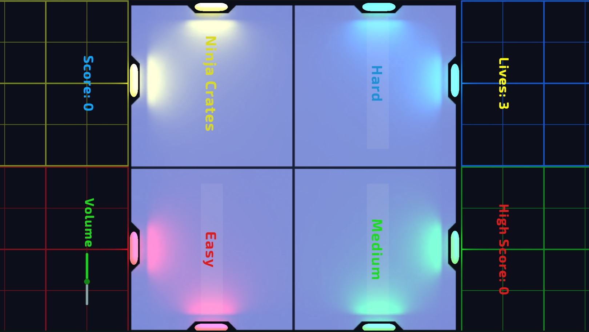

# Prototype 5 (Unity 6)



**Prototype 5** is an arcade-style slicing game inspired by the classic Fruit Ninja, developed as part of the **Unity Junior Programmer Pathway (Unity 6)**.

Players slice flying crates while avoiding dangerous objects, testing their reflexes and timing. The project focuses on implementing core gameplay systems, including object spawning, collision detection, score tracking, UI management, and game state logic.

---

## ▶️ Play Demo

- [🎮 Unity Play Demo](https://play.unity.com/en/games/5d11a7b7-a6ef-4564-9ec8-67f55f907446/prototype5ninja-crates) 
- [🌐 itch.io Demo](https://https://faez-mahmoudi.itch.io/prototype3)


## ▶️ Gameplay Video

- [Watch Gameplay Video](Videos/Prototype5_U6_1080p.mp4)

---


## 🧠 About

This project demonstrates core Unity skills including:

- Physics-based object slicing
- Collision detection and gameplay interactions
- Dynamic object spawning system
- Custom lighting and scene presentation
- Responsive UI and HUD implementation
- Score tracking and game state management
- Audio and visual effects integration
- Overall gameplay polish and optimization

The goal of this prototype is to practice basic interactive game mechanics using Unity and C#.

---

## 🚀 Features

- 📦 Slice airborne crates instead of fruit
- ⚡ Simple and responsive slicing mechanics
- 💥 Visual feedback on successful hits
- 💡 Improved lighting and scene presentation
- 🎨 Clean and intuitive UI
- 🏆 Real-time score tracking
- 🌐 WebGL support for instant browser play   

---

## 🎮 How to Play

- **F** → Fire bomb   
- **Collect items** to gain temporary abilities for destroying obstacles 
- **Collect dollars** to have chance to continue
- **Space Key** → Jump(double jump)  
- Avoid obstacles and black bombs to survive  

---

## 📦 Getting Started

### 🔹 Clone the repository
```bash
git clone https://github.com/Faez-Mahmoudi/Prototype3_Unity6.git
